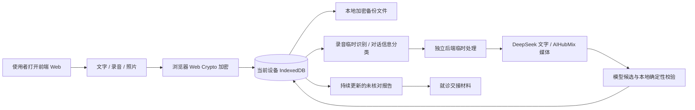

# 病历不归零·内测版

> 2026-10-01 源码交付候选。最近本地回归为后端 845 项、前端 126 项通过，并已实测保存失败恢复、修订链删除和原件核对门禁。整页识别准确率、云端服务连接、线上完整流程、真机和临床审查仍未全通过。本次只上传源码，不更新线上服务。详见 [当前交接与验证范围](docs/GITHUB-STATUS-2026-10-01.md)。

一个面向个人和家庭的健康对话与记录工具。目标是根据使用者的表达作对应回应，按需要追问，并保存有原话来源的就诊沟通材料；文字、录音和照片在本机加密保存。AI 输出需要核对，不是诊断、医嘱或用药决定。

## 当前状态

项目已从比赛演示架构转向内测版架构。代码在一个仓库中同时保留完整前端和后端，运行时是两个独立服务：使用者只打开 `5173` 上的图形前端，页面再调用 `18768` 上的后端 API。

目标闭环是：连续说话 → 原录音先在本机加密保存 → 真实转写 → 小零结合当前表达和本次勾选的相关背景，先回应疑问、担忧或纠正，有必要时再追问 → 报告随对话更新 → 退出后恢复并继续补充。允许只回应而不提问。老人不需要逐段确认、点击“生成报告”、绑定家属设备或再次输入网站密码；说错的文字可以直接在聊天气泡里修改，首页记录和报告随后同步更新。当前本机真实转写和模型回应已实际接通；失败时保留原件和已输入的文字，不产生模拟病历。

问诊采集覆盖主诉、起病与变化、症状特点、加重或缓解情境、伴随表现、功能影响、相关既往情况以及本次已经做过的处理和结果。它不会按固定顺序逐项盘问：一句话已经说清多个维度时会直接跳过，通常 4 至 8 问，硬上限 12 问；用户明确结束、连续没有新事实或继续追问收益很低时会停止。

2026-09-30 主控实测：用户明确授权后，现有本机密钥已恢复真实服务，最新语音闭环由原生 MediaRecorder、AIHubMix 和 DeepSeek 完成。当前本机入口为 http://127.0.0.1:18932/，后端 18933；云端仍是之前的版本，本轮没有部署。追加真实请求与页面复验已经执行；真机、更广的多轮病例与临床审核未全部完成。

仍未完成或未验证的部分：

- 追加 17 次真实请求已由主控亲自执行，具体病例、修复前后版本与尚未独立重跑项见最新复验记录；不把它说成所有病例和当前规格全部通过；
- 将本轮已补的签名会话、CSRF、频率与并发保护部署并复验；本地修改尚未改变线上服务。多实例总费用上限仍需网关或供应商预算；
- 本轮已改为发送前显式选择最多 5 项背景，默认不上传；仍需真实模型成对验证相关背景的问答收益和遗漏情况；
- 新建私有 TOS Bucket、配置最小权限身份和浏览器 CORS，并在真实 Bucket 验证密文上传/下载；
- 真实手机录音、照片、断网与空间不足验收；
- 由具备资质的临床专业人员审核问诊维度、风险规则和医生交接材料；完成前不能宣称临床级或直接公开给真实患者使用；
- 当前已接受规格 R1–R13 的全量验收，包含真实语音与上下文回应、真人临床审查。

## 数据怎么流动



恢复口令只在当前设备用于包装/解包数据密钥，不上传到函数服务或 TOS。丢失恢复口令时，服务器不能代为解密备份。

## 快速启动

需要 Python 3.12 和 Node.js 22+。

```bash
git clone https://github.com/Irixil/bing-li-bu-gui-ling.git
cd bing-li-bu-gui-ling
python3.12 -m venv .venv
source .venv/bin/activate
python -m pip install -r requirements-dev.txt
cp .env.example .env
```

在 `.env` 中填写：

- `DEEPSEEK_API_KEY`：文字整理；
- `AIHUBMIX_API_KEY`：语音转写和照片识字。

启用私有云备份时需给函数绑定最小权限 IAM 角色，并设置 `TOS_REGION`、`TOS_ENDPOINT`、`TOS_PUBLIC_ENDPOINT` 和 `TOS_BUCKET`。veFaaS 会在每次请求中注入短期 STS 凭据，线上不保存长期 TOS AK/SK；角色权限只允许目标 Bucket 的备份前缀。

先检查配置（不调用模型）：

```bash
python -m scripts.start_app --check-config
```

一条命令同时启动两个独立服务：

```bash
python -m scripts.start_dev
```

请打开前端页面 <http://127.0.0.1:5173/>。后端 API 在 <http://127.0.0.1:18768/>，不需要手动打开。

需要分开启动时，使用两个终端：

```bash
python -m scripts.start_backend
python -m scripts.start_frontend
```

首次打开可建立本机加密记录库，或从加密备份恢复到空库。日常使用只需输入这个本机恢复口令。本地回环启动自动建立签名 API 会话，无第二个网站密码；公开环境默认不自动授予 AI 权限。进入“和小零聊聊”后可以直接打字，或点麦克风开始说；停顿约 3 秒会自动结束这一句话，也可以手动点“结束这句话”。识别成功后文字会进入当前对话，临时录音随即清理；识别失败时原录音保留，供用户重试。照片和单独上传的录音仍可在“看病资料”中保存、识别和核对。

对话中的“带上相关资料”是可选步骤，最多勾选 5 项；只保存在本机，下次发言才带上。未选择的背景不上传。长对话仅向模型发送最近 40 段老人原话及其对应问题，完整原话和修订仍保留在本机。

每次保存老人原话后，页面都会更新一份“自动整理 · 本人未核对”的报告。离开页面不需要额外操作；同一天回来会直接续聊，隔天会让用户选择接着上次说还是记录新情况。

## 低成本 AI 组合

- 连续对话：DeepSeek `deepseek-chat` 根据原话、既往回答和相关本机健康背景，生成带原话编号的事实状态、简短回应和一个候选追问。后端会验证来源、问题范围、重复、轮数和医疗越界；停止门限与危险提醒由确定性规则兜底。
- 旧记录整理：DeepSeek `deepseek-chat`，只发送使用者明确选择整理的原文和受限历史证据。
- 语音转写：AIHubMix 默认 `gemini-2.5-flash-lite`。
- 照片识字：AIHubMix 默认 `qwen3.7-plus`，限制思考长度并逐行保留表格。识别草稿仍需对照原件，尤其遮挡、手写和裁切位置。
- 本地主数据：原话和原件仍可保存、修订、筛选、打印和备份。

一次新对话回复会产生一次低价文字分类请求；一次媒体保存会产生一次识别请求。媒体失败后不自动付费重试，只在使用者点击重试时再次调用。具体费用以各服务商当时账单为准。

## 验证

2026-09-30 最新本地结果：Python 835 项、前端 107 项、类型合同检查通过；已用真实服务验证合成语音、上下文回应、图片识别与整理，并实际验证纠错、断网重开、手动重试、备份恢复、背景最小化、手机宽度报告与 A4 PDF。最终 17 例模型批次、真机与临床审查仍未完成。详见 真实基础功能验收（本机验收记录，未公开）。

```bash
# Python 全量回归
python -m pytest -q

# 浏览器逻辑、加密仓库与安全规则
node --test tests/*.test.cjs

# 前后端接口类型
npm run check:contracts
```

2026-09-20 当前工作树验证结果：Python `791 passed`，Node `56 passed`，TypeScript 合同检查通过。隔离真实浏览器已完成相关健康背景保存、基于老人当前表达的自然追问、诊断请求边界、资料足够后停止、退出与刷新恢复、原话气泡内修改、首页与报告同步、按主要不适、起病变化、症状与生活影响、相关背景和待核实项编排的医生交接、逐条原话追溯、桌面与手机布局、手机记录列表的横向原话排版、关键词搜索按钮与结果定位、“查看”直接进入独立记录详情页及返回列表、以完整会话为单位的日期摘要与 AI/老人双方原始对话还原、每张记录卡片右下角可确认的删除入口，以及固定危险提醒；真实 DeepSeek 合成样例也通过当前结构化合同。详细记录见 专业病史采集闭环验证（本机验收记录，未公开）、完整对话归档验证（本机验收记录，未公开）、完整对话删除验证（本机验收记录，未公开） 和 逐条记录删除入口验证（本机验收记录，未公开）。这些结果证明本地技术闭环，不替代真实手机麦克风、临床专业审核、正式云环境和真人可用性验收。

## 安全约束

- `APP_MODE=local_first` 时，旧的 SQLite 健康数据 API 关闭，不用于公网保存用户健康资料。
- 在线 AI 接口只接受配置好的精确前端来源，API 密钥不下发前端。
- 老人原话先落入本机加密仓库，AI 失败不会删除原话或报告；模型只能返回带原话证据编号的信息状态。
- 危险描述不等待模型：本地规则直接输出固定的就医/急救提醒。任何模型生成的诊断、病名判断、加减停换药、剂量或治疗方案都不会进入聊天回复。
- 系统通常提出 4 至 8 个问题，硬上限 12 个；同一维度最多两问，“不知道/不记得/不想说”会关闭该话题，连续两次没有新事实就停止。
- 当前无登录、无设备绑定的 MVP 只用于本地或受控内测；加入限流或新的简化保护前，不要把可消耗 AI 额度的后端直接公开到互联网。
- 函数处理的媒体写入临时文件，完成或失败后删除，不写入云端健康数据库。
- 离线危险提醒是有限描述匹配，不是医学评估；“未命中”不等于“正常”或“无风险”。
- 删除当前设备的记录不会自动改写旧的加密备份；界面必须在删除前说明这一点。

## 项目文档

- [已确认的最小闭环规格](docs/sdlc/spec-minimal-loop-v4.md)
- [已确认的最小闭环实施方案](docs/sdlc/plan-minimal-loop-v4.md)
- [已确认的连续对话规格](docs/sdlc/spec-conversational-intake-v5.md)
- [已确认的连续对话实施方案](docs/sdlc/plan-conversational-intake-v5.md)
- [已确认的专业病史采集规格](docs/sdlc/spec-clinical-intake-v7.md)
- [已确认的专业病史采集实施方案](docs/sdlc/plan-clinical-intake-v7.md)
- [AI 模型接入](docs/MODEL-CONNECTION.md)
- [当前 API 合同](docs/API.md)
- [验证记录](docs/VALIDATION.md)

项目代码目前未授予通用开源许可证。公开病例改编资料的独立许可以对应资料说明为准。
<!-- 2026-10-01 source accuracy boundary -->
照片识别文字先作为待核对草稿保存。打开原件逐行检查，把看不清的部分改为 `[无法辨认]`，再保存原件核对结果；此前不能进入整理或就诊交接正文。修订后需要重新核对，原件与旧文字保留。此门槛防止 OCR 猜测被自动当成事实，不表示模型能准确识别所有照片，也不替代人工或临床审查。
