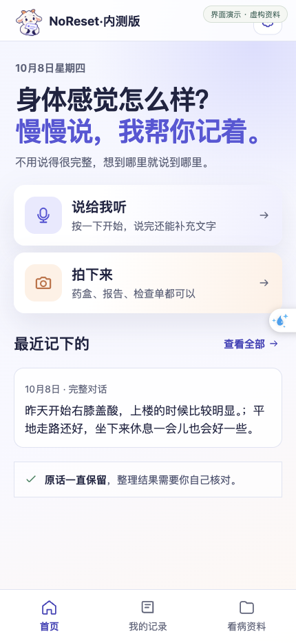
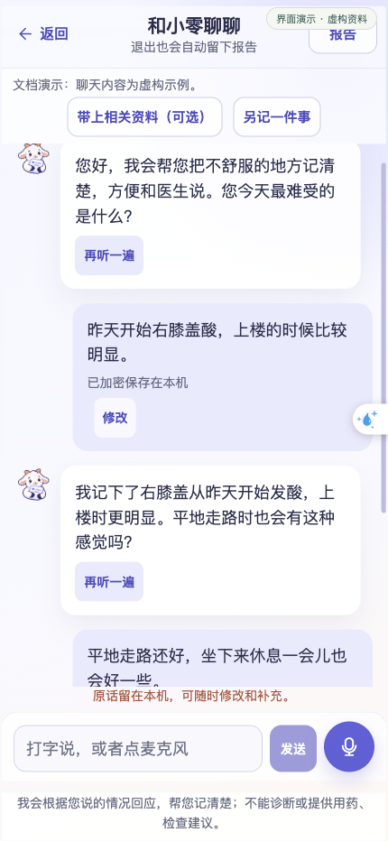
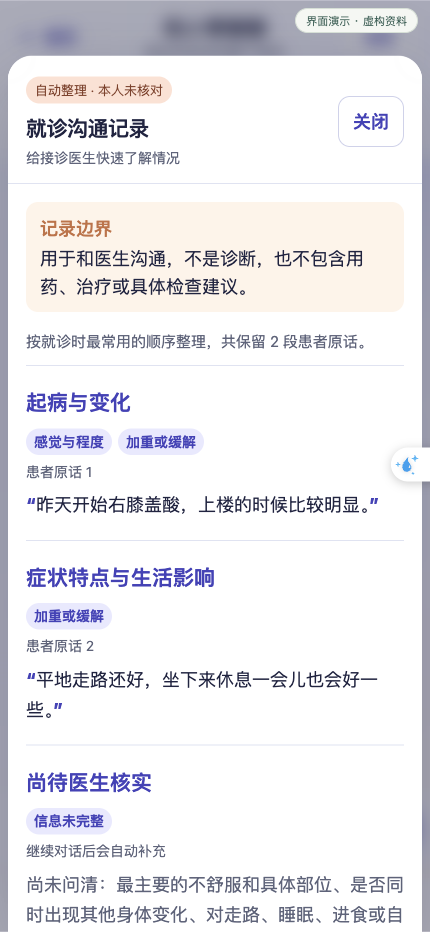
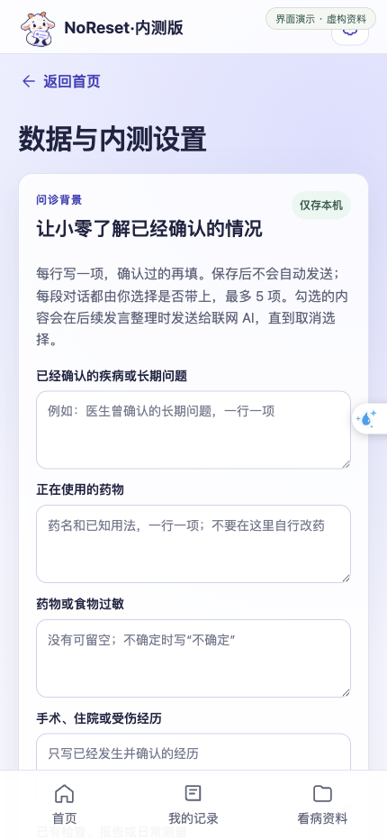
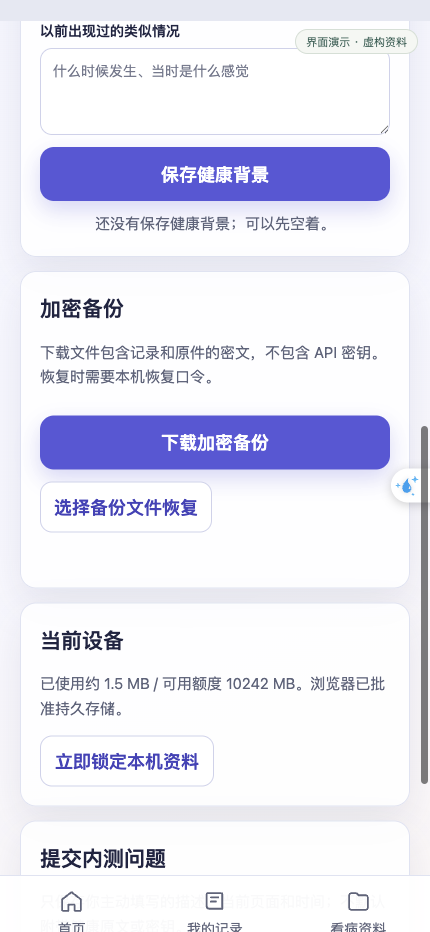

<div align="center">
  
  <h1>NoReset</h1>
  <p><strong>病历不归零，让每一次健康记录都能接着说。</strong></p>
  <p>AI 健康对话 · 看病资料整理 · 就诊信息交接</p>
  <p><a href="#开始使用">开始使用</a> · <a href="#有哪些功能">功能介绍</a> · <a href="#在自己的电脑上运行">本机运行</a></p>
</div>

---

NoReset 帮你把零散的身体感受、录音、检查单和日常记录留在一起。你可以用自己的话和「小零」交流，随时补充、纠正，再把有原话和资料来源的记录带给接诊医生。

它适合想少填表、多说话的使用者，也适合陪家人一起整理看病资料的人。

<p align="center"></p>

## 有哪些功能

| 你想做的事 | NoReset 怎么帮你 |
| --- | --- |
| 把不舒服说清楚 | 打字或录音，与小零连续交流；结合当前表达作回应，有需要时一次追问一个问题。 |
| 说错了，重新改一下 | 直接修改聊天中的原话，保留修改版本，让关联记录随之更新。 |
| 留住报告、药盒和检查单 | 拍照或上传原图，识别文字后对照原件核对，再用于整理。 |
| 让小零了解相关背景 | 保存已确认的既往情况、用药、过敏等；每段对话自行选择是否带上，最多 5 项。 |
| 看病时少漏说 | 从对话查看就诊沟通记录，或选择历史记录生成交接材料，用浏览器打印、保存为 PDF。 |
| 过几天接着记 | 回到未完成的对话继续补充；按关键词、类型、状态和日期查找旧记录。 |
| 妥善保存自己的资料 | 在当前浏览器加密保存，下载加密备份，使用恢复口令恢复。 |

## 从聊天到就诊沟通记录

<table>
  <tr>
    <td width="50%" align="center"><strong>按自己的节奏说</strong><br><sub>原话可以修改，相关背景可以自行选择。</sub></td>
    <td width="50%" align="center"><strong>随时查看记录</strong><br><sub>按主题整理，保留原话与待核实事项。</sub></td>
  </tr>
  <tr>
    <td></td>
    <td></td>
  </tr>
</table>

<sub>配图来自实际应用界面，聊天内容为虚构演示数据，用于说明操作。</sub>

## 开始使用

### 1. 建立自己的记录库

第一次打开，设置一个至少 **10 个字符**的恢复口令，再输入一次确认。之后在同一浏览器中，用这个口令解锁自己的资料。

记住口令，并定期下载备份。恢复口令不会上传，忘记后无法由服务器代为找回。

### 2. 和小零聊聊

在首页点 **「说给我听」**，进入 **「和小零聊聊」**。

- **打字**：在输入框写下你想说的，发送即可。
- **说话**：允许浏览器使用麦克风，开始录音；说完可点 **「结束这句话」**，也可以等停顿后自动结束。
- **继续补充**：说出什么时候开始、具体感觉和对生活的影响，不需要一次说完整。
- **改正原话**：发现文字有误时，使用对应聊天气泡的修改入口。
- **带上相关资料**：点同名按钮，勾选这次需要的健康背景；也可以一项不选。

例如，可以从「昨天开始膝盖酸，上楼时比较明显」说起，再随着对话补充。小零会根据当前内容回应，你也可以提问、说明没听懂，或直接结束。

离开页面后，回来可以接着上次说；另有一件事时，选择 **「另记一件事」**。

### 3. 拍下并核对看病资料

首页点 **「拍下来」**，或从底部 **「看病资料」**进入，保存报告、检查单、药盒等原图。单独的录音也可以作为资料上传。

识别后先打开原件，对照文字逐行核对，尤其注意 **日期、数字、小数点、单位和药名**。没有看清的内容留待核实；完成原件核对后，再用于整理记录。

识别失败时，原件仍可保存，稍后从资料页面重试。

### 4. 看记录，准备就诊材料

聊天中的 **「报告」**按钮可以查看本次就诊沟通记录。记录里包含原话、相关背景和需要继续核实的内容。

在底部 **「我的记录」**中，可以搜索旧记录、查看完整对话，并选择记录或日期范围，点 **「生成就诊交接材料」**。预览后用浏览器打印，或选择「另存为 PDF」，再自行交给医生。

## 健康背景与加密备份

在右上角 **设置**中，填写已经确认的长期问题、正在使用的药物、过敏、手术或住院经历、已有检查和过去类似情况。

这些背景先保存在本机。保存不等于发送；进入具体对话后，由你选择这次是否带上。选中的内容会随后续发言发送给在线 AI，直到取消选择。

<table>
  <tr>
    <td width="50%" align="center"><strong>保存已经确认的背景</strong></td>
    <td width="50%" align="center"><strong>备份与恢复自己的资料</strong></td>
  </tr>
  <tr>
    <td></td>
    <td></td>
  </tr>
</table>

**备份**：在设置中点「下载加密备份」，把 `.bingli` 文件保存在自己能找到的位置。备份包含记录和原件的密文，恢复时需要对应口令。

**恢复**：新浏览器第一次打开时，可以选择「已有加密备份？从备份恢复」；也可使用设置中的恢复入口，先检查文件，再按页面提示操作。

记录保存在当前设备、当前浏览器中，不会自动出现在另一台设备。清理浏览器数据或换设备前，请先做好备份。

## 在自己的电脑上运行

准备 **Python 3.12**，以及自己的 DeepSeek、AIHubMix 服务配置。完整应用代码使用下方指定的整合分支。

```bash
git clone --branch codex/backend-integration-2026-09-14 https://github.com/Irixil/NoReset.git
cd NoReset
python3.12 -m venv .venv
source .venv/bin/activate
python -m pip install -r requirements-dev.txt
cp .env.example .env
```

在本机 `.env` 中填写：

```dotenv
DEEPSEEK_API_KEY=你的文字对话服务密钥
AIHUBMIX_API_KEY=你的语音与图片识别服务密钥
```

填写自己的配置，不要把 `.env` 上传到 GitHub。在线对话、转写与识字会使用对应服务，费用按服务商规则计算。

检查配置并启动：

```bash
python -m scripts.start_app --check-config
python -m scripts.start_dev
```

打开 **[http://127.0.0.1:5173/](http://127.0.0.1:5173/)**，按上面的步骤建立记录库。前端默认使用 `5173`，后端 API 默认使用 `18768`；日常只需要打开前端页面。

<details>
<summary><strong>Windows 启动方式</strong></summary>

使用 PowerShell，将上方创建环境、激活环境和复制配置的步骤换为：

```powershell
py -3.12 -m venv .venv
.\.venv\Scripts\Activate.ps1
python -m pip install -r requirements-dev.txt
Copy-Item .env.example .env
```

填写 `.env` 后，同样执行配置检查与 `python -m scripts.start_dev`。

</details>

## 常见问题

**一定要录音吗？**

不用，直接打字也可以。使用录音时，浏览器需要麦克风权限。

**不联网还能做什么？**

本机解锁后可以查看、修改已保存的记录与资料；在线 AI 对话、转写和识字需要网络及对应服务。回复失败时，已经保存的原话仍可继续查看。

**核对记录代表已经处理了身体问题吗？**

核对只确认记录内容。NoReset 用于记录与就诊沟通，诊断、治疗和用药决定请交给医生。

**删除记录后，旧备份也会一起删除吗？**

不会。已经下载的备份是独立文件，需要自行管理。

## 进一步了解

[模型接入说明](https://github.com/Irixil/NoReset/blob/codex/backend-integration-2026-09-14/docs/MODEL-CONNECTION.md) · [API 文档](https://github.com/Irixil/NoReset/blob/codex/backend-integration-2026-09-14/docs/API.md) · [当前产品规格](https://github.com/Irixil/NoReset/blob/codex/backend-integration-2026-09-14/docs/sdlc/spec-contextual-dialogue-v10.md)

代码目前未授予通用开源许可证。公开示例资料的独立许可见对应资料说明。
